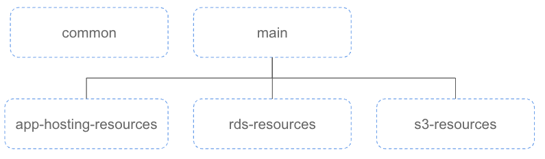
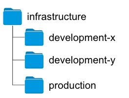
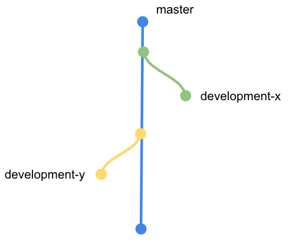
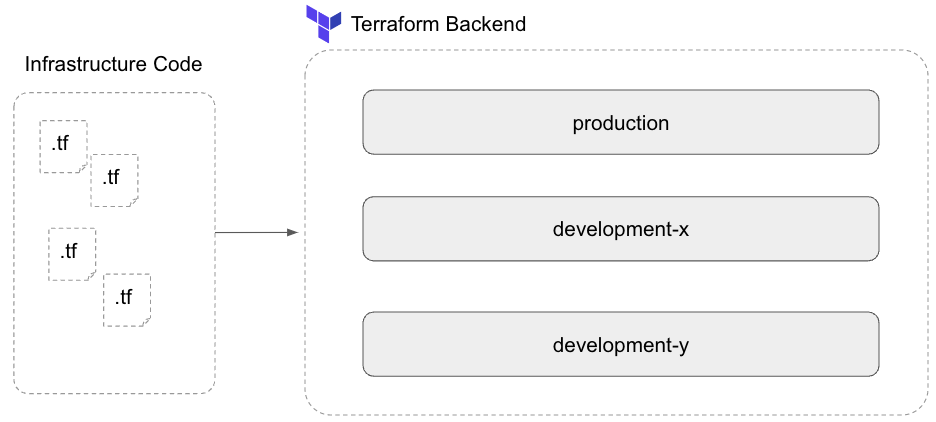
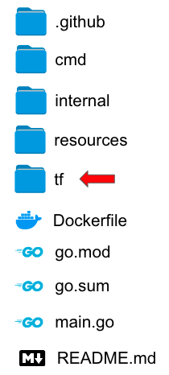
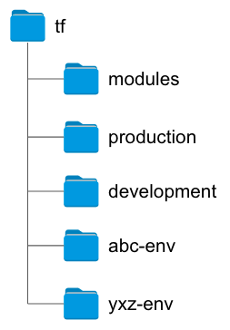
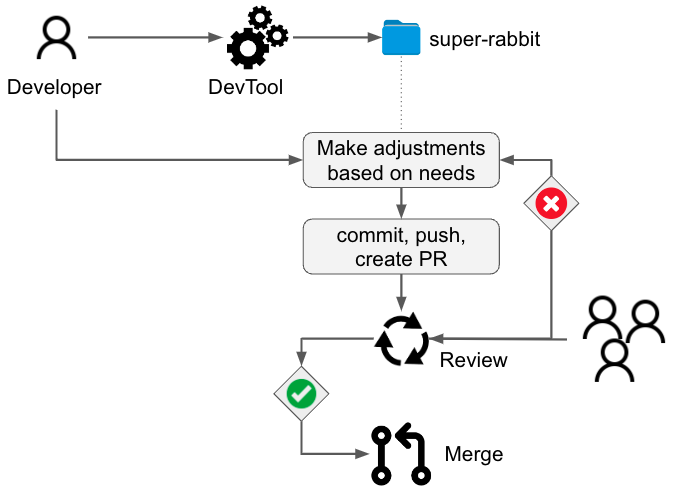
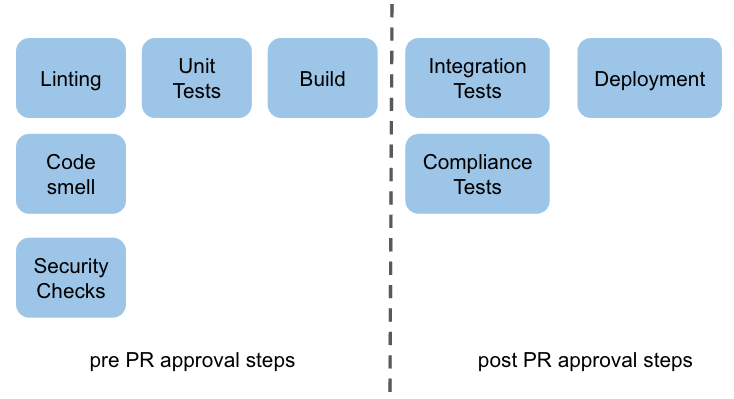
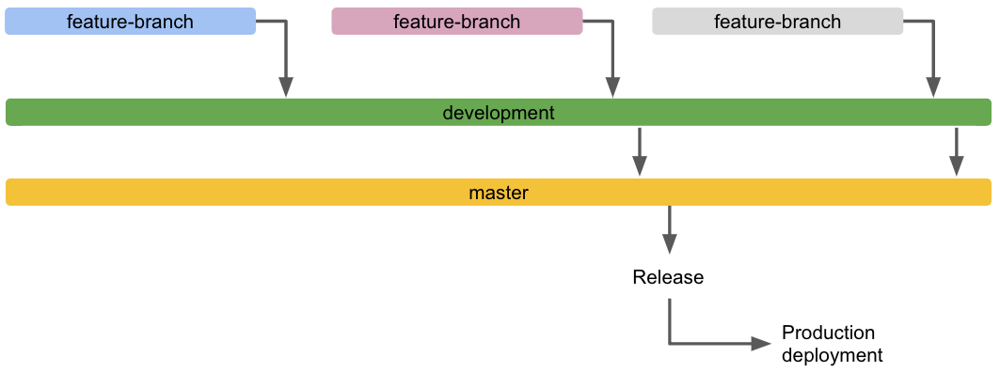

# Senior Tools Developer Homework

## Assumptions

Provided assumptions:

* Developers all use Git and GitHub
* The process for requesting a new environment can be tied to GitHub pull requests
* We have an existing CI/CD pipeline

Additional assumptions:

For this proposal, we will also consider that

* The production environment was deployed manually to AWS
* The production application leverage a DB (which we consider deployed with the RDS service)
  

## Proposal

### Infrastructure as Code

Considering the fact that the expected environments must be unique and ephemeral, the most important aspect of this proposal is to codify the 'on-demand' test environments.

Since the environment will be unique and ephemeral, it is an obvious choice to go with Immutable Infrastructure.
This means that the code will represent the expected state of the infrastructure and that, no matter how many or when environments are deployed, the result will always be the same. (In opposition to mutable infrastructure where modifications can be made (intentionally or not) to the system other the time).

This mean that, if a change is required on the infrastructure (such as: changing the size of an instance) and its dependencies (such as: the installed Golang version), a modification to the infra code is necessary as well as the deployment of this new infra version.
This guarantee the traceability and documentation of changes and is perfectly adapted to short time living environments.

Talking of solutions for this, we could consider the following:

- Native Go code (Go AWS SDK for instance) (Could be another language though)
- CloudFormation templates
- Terraform
- Pulumi

(Technically, we could consider other solutions (such as: Docker Compose, K8S, Vagrant ...) but since the goal is to replicate a production environment, we consider here and infrastructure as close as possible from what could be the existing production environment (including the network aspect of it, DBs, Messaging, Logging ....)).

#### Native Go code

Leveraging the Go AWS SDK (we will consider in this example that the environments are aimed to be deployed on AWS and that the team is using Go as main language) to describe the infrastructure is possible. It could be interesting because it does not require to learn a new language, it's testable and well supported and documented.
But, following this path would require a lot of work to create a friendly codebase with reusable components when other (like Hashicorp) have already did the job, also, if a cloud-agnostic approach is necessary in the future, all the work done for AWS might require to be cloned/adapted for other cloud provider (and even if they support Go). It's then, not the recommended way.

#### CloudFormation Templates

CloudFormation is an Infrastructure as "Code" (actually more Infrastructure as Spec) available for a while, well supported and documented. But, it has several limitations, such as: only support JSON and YAML as descriptive "language" and only support AWS APIs which is a blocker for a cloud-agnostic approach. It's then, not the recommended way.

#### Terraform

Terraform is a "what you code is what you get" tool designed to be cloud agnostic. It's well known, supported and documented solution. Written in Go (which guarantee simplicity and possible extensibility (also because most of it is Open Source)) it leverage an accessible hybrid language, HCL2, which require to learn a new "language" but since it's basically a structured configuration language which support functions and computation, the learning curve is not that steep.
Terraform completely fulfill the requirement of Immutable Infrastructure specification and is natively cloud agnostic. It's then, the best choice for the need.

#### Pulumi

Pulumi is an Infrastructure as Code platform that allows to use a variety of common languages to describe infrastructures. It supports Go and have decent support, a complete documentation and is cloud agnostic. Even if it's possible to describe Immutable Infrastructure with Pulumi, it give its full potential with Mutable Infrastructure and would be an excellent solution for a team who would have a lot of pros to go with the first solution (native Go code) but would speed up the development with an existing SDK (also mainly Open Source). It's not the recommended way here, but can be kept as a contender if the choice of Terraform is questioned along the way.

### Deployment

While building the bricks to deploy Immutable, short live, uniq environments, there's no reasons to not codify the existing prod environment at the same time (because we consider here that the prod was deployed manually).

The infrastructure code would then be structure like:


where:

> *NOTE:*
> 
> Name are chosen here for clarity of the proposal and should not be considered as best choice for long term.

- common is a root module defining common resources that are shared across environment (like VPCs, IAM accounts, terraform backends ...).
- main is the root module of the application environment
- *-resources are sub-modules describing specific parts of the infrastructure

There are several ways for the environment segregation:

#### Splitted by folders



This approach is certainly the simpler to put in place but will become really fast a nightmare to maintain.
this would require a lot of code duplication, it's easy to forget to replicate a change and it makes the changes review more difficult.

#### Splitted by repos

(I don't think it requires visual representation ;) )

It can be easy to fork the "infrastructure reference" repository to create a new environment.
But, it also create a huge code duplication, makes updates more complex (always simpler to rebase a branch than updating from an upstream) and it also makes the changes review more difficult.

#### Splitted by branches



Creating a new branch to represent a new environment allow for easy tracking of changes and code review. But to review change using Pull Request will be mandatory and the feature branch need to be merged somewhere. Which would make a big sapghetti of branches (having to create a dedicated branch where the "new-env" branch will be merged ...). Definitely not ideal.

#### Splitted by workspaces



Thanksfully, Hashicorp thought about such thing and proposed the concept of "Workspaces" for Terraform. But just using workspace does not solve the problem of storing the different environments.

The different workspaces can be stored in the Terraform backend, but it doesn't solve the code review asepect of it. The developers still need to push their code somewhere, so, it's backed up (in case of computer failure, employee sick or moving on from the company), reviewable ...

#### The suggestion

The list above is not exhaustive and there might be other ways of splittingthe different environment, it's clear that there's no easy and simple way. One thing that is clear is that with Infrastructure as Code it's always a question of compromises.

So to allow the developers team to create on demand, disposable and uniq environment from a reference, we will need a combination of the different mentioned solutions.

The first thing to consider is: Since the environment are uniq, how to diferentiate them ?

Let's give them a name ! (It can be a UUID  (meh :/ ), the developer's name (what if they have multiple test envs ?), a random petname (yeah !) ... )

But also, a developer might need to test with a "non standard" infrastructure setup (like a new version of the software require more resources, a new featur require a new service from AWS ...).

So let's consider we keep the infrastructure code close to the application code:



A tool (homemade) would allow the developers to generate a new env. This tool generate a root module that describe a new uniq environment.



The tool (let's call it "DevTool" to be super creative), can leverage the `text/template` package to generate the environment's Terraform files.
A minimum amount of files would be like:

`providers.tf`
```
provider "aws" {
  alias   = "us-east-1"
  region  = "us-east-1"
  profile = "XYZ"
}
```

`main.tf`
```
module "development" {
    source = "../development"

    env_name = ">AutoGeneratedNameByDevTool<"
    vpc_id   = var.vpc_id
    ...
}
```

`variables.tf`
```
variable "env_name" {
  description = "The name of the Environment. This variable is used to namespace all resources created by this module."
  type        = "string"
}

variable "vpc_id" {
  description = "The ID of the VPC in which to deploy the envionment"
  type        = "string"
  default     = "vpc-12345678901234567"
}

...
```

`outputs.tf` (Mostly for information/auto-generated doc from the CI/CD logs)
```
output "environment_name" {
    value = module.development.env_name
}
```

An `tf/development/main.tf` could look like:
```
module "vpc" {
  source   = "../modules/vpc" // or a git uri
  vpc_id = var.vpc_id
}

module "application_hosting" {
  source   = "../modules/application_hosting" // or a git uri
  env_name = var.env_name
}

module "rds" {
  source   = "../modules/rds" // or a git uri
  env_name = var.env_name
}

module "s3" {
  source   = "../modules/s3" // or a git uri
  env_name = var.env_name
}

...
```

The `application_hosting` is a bit vague here. Since we consider the application(s) is/are written in Go, generating a docker container as an artifact result of the compilation phase from the CI/CD pipeline would allow a good flexibility (allow local run, easy deployment ...)

The solution for this could be:

(with each of the suggested solutions managed by a Terraform module off course)
- Standalone docker run from an EC2 instance
- Docker-Compose from an EC2 instance
- ECS/EKS service
- Kubernetes cluster
- Nomad cluster

To come back on the environment deployment process: once the developer as their auto generated infra files, they can make any needed adjustments, then push them to a feature branch to finally open a PR.



Once the PR is open, the CI/CD pipeline is triggered in at least two steps separated by human validation:



At the PR opening, the pipeline would check for:

- Linting
- Code smell
- Security (with the code itself or its dependencies)
- Unit testing
- Application build

Then, if all these steps pass, the merge would be allowed (according that the minimum amont of reviewers ahve already approved the PR).
Once the PR has been merged to the `development` branch, next steps such as:

- Integration testing
- Compliance testing
- Envionment deployment

can be triggered.

In this example we consider the following git flow:



With the different dev/test environment co-existing in the devlopment branch, master being considered as the "stable branch" and with the deployments triggered to production when a release is created.

### Monitoring, Logging & Observability

To be able to determine if a change (bug correction, new feature, refactoring ...) as a positive or negative impact on the software, observability is required.

A logging solution to centralize the logs from the different environments is required as well as resource usage monitoring.

This part of the architecture should be splitted in two parts:

* A long living stack, managed by Terraform in the `common` modules folder.
* Tooling in the `development` module to automatically configure the new environment in the monitoring/logging stack.

> *Note:*
> For the possible solutions/tooling for monitoring & logging aggregation, please refer to the next pont: APM.

### APM

It is a good idea to provide tooling to help analysis of applications performance, both in the testing and production environment. The APM tooling will be use slightly differently from the two kind of environments though:

- Testing: proactive performance degradation search, bug detection ...
- Production: curative help to debug an issue that couldn't be detected in testing envs

This would require collaboration from the development team(s) to to add metrics and probes in the codebase.

Different solutions offers APM support:

- Datadog
- New Relic
- AWS X-Ray + AWS Cloudwatch
- ELK
- TICK

The choice of the best tool for the need will depend on other choices (like monitoring and observability stack) but also would be better chosen with the development team(s)'s participation.

### Testability

Without covering aspects of the testability of the application (which would be a bit irrelevant here), the infrastructure still require testing.

It can more complex (and even sometimes impossible) to unit test infrastructure code (like it might be easy to unit test an IAM account or a VPC creation, but unit testing an instance creation will require dependencies which lead by default to an integration testing approach). Still testing is important.

It would be clever to add tests to the `development` module. So when changes are made to the infrastructure code (like, the application as a new dependency that have been tested successfully in one of the ephemre env, it's now time to deliver this new dependency with every dev/test environment).

Since testing infrastructure will almost always require to actually create resources and validate the outcome, it's not necessary mandatory to run infra tests before every deployment, but it's a good practice to run them before merging a new bugfix, feature, refactoring ... A nightly or weekly test suite can also be run and is actually a good placeholder for chaos testing. Having tools that will "tickle" the environment may lead to unanticipated situations and unveil possible caveats.

Example of such tests can be:

* Shooting live instance to validate disaster recovery (especially for high availability environment)
* Hardcore load testing
* DDOS attempts
* Simulation of availability zone failure (especially for high availability environment)
* Data corruption / Data destruction

### Compliance

As we mentionned before, the developers have the possibility to extend the Terraform modules to make the infrastructure evolving with the applications. As a good practice is to review changes via Pull Requests and/or pair programming, it's difficult, if not impossible, to track and think about all the small details that can have a bigger impact.

Compliance as Code is a specific set of tests and rules (specifications) that are designed in collaboration with the security team (or provided by security team) and describe what is expected from the infrastructure.

> *Note:*
> We're talking here about infrastructure but is also valid for application code.

Example of compliance specifications can be:

* User access policies (for example: the given IAM group should have RW on these resource on only RO on other resources)
* Resource sizing (for financial reason or to guarantee resource access for all services in a shared environment)
* Pipeline rules (like minimum number of reviewer or pipeline failure on setp unsuccessful ...)
* Environment conformity (expected number of resorce delpoyed with expected attributes ...)

## Final thoughts

It's not easy to cover everything that comes to mind through a document, but I tried to make it as clear and concized as possible.
It is built more or less like a design doc to represent how I like to work in a team: in collaboration.
Designing complex solutions is always a matter of compromizes and a decision that appeared to be the best at a moment can be not anymore the best one in the future.

There's is a lot of things that I was not able / decided to not cover in this document to keep it lean and easy to read. It will be a pleasure to discuss in more details those points with you.

Thank you.
